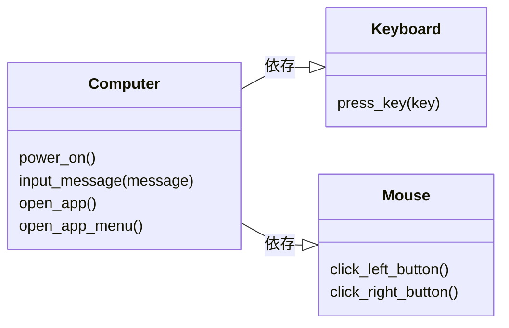
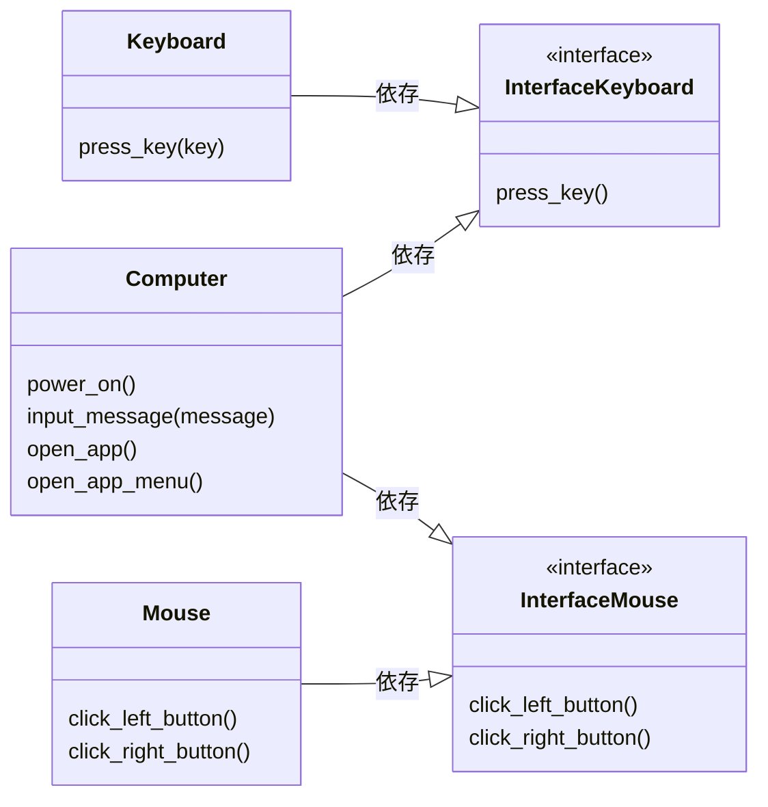

## 本記事の目的
ある程度アプリケーション開発を行なっていると目にするようになるDI:Dependency Injection、DIP:Dependency Inversion Principleですが、  
記事を見ても専門用語が多くてよくわからなかったり、実装はできたもののそのありがたさまでは実感できなかったりと、  
知識止まりになることが多いのがDI/DIPです。  

本記事では、DI/DIPが効果的に働くテスト実行時やコード変更時を想定し、DI/DIPのあり/なしでどのような違いが出るのかを見てみます。  
また、DI/DIPに付随して、テストに対する考え方も少し記載していますので、テストコード実装時の考え方も整理してみます。

### 本記事の対象外
上記の通り、本記事はDIの実装および効果を見ることが目的のため、以下のような内容は範囲外としています。  
* クリーンアーキテクチャに関する話
* SOLID原則に関する話
* DIフレームワークの説明

まずは 使ってみる→DI/DIPの効果を知る からはじめ、もっと知りたくなった方は上記を調べてみるとより理解が深まると思います。

## 実行環境
Pythonの実行環境があればお好みの環境で。  
今回利用するpythonのモジュールは以下になります。事前に`pip install`でインストールをお願いします。  
```
pytest
injector
```

## クラス設計
今回は以下のようなクラス設計に従いコードを実装していきます。
1. `Keyboard`クラス  
    キー押下機能を提供する
    この機能は、押下されたキーを知らせる文字列を返す
1. `Mouse`クラス  
    右クリック、左クリック機能を提供する  
    それぞれの機能は、クリックを検知したことを知らせる文字列を返す
1. `Computer`クラス  
    電源オン、メッセージ入力、アプリ起動、アプリメニュー起動の4つの機能を提供する  
    電源オン、メッセージ入力には`Keyboard`クラスが提供するキー押下機能を利用する  
    アプリ起動、アプリメニュー起動には`Mouse`クラスが提供するクリック機能を利用する  
    各機能は内部で行なわれた操作を知らせる文字列を返す

DI/DIPを理解するうえでも重要なオブジェクト指向ですが、現実世界に置き換えてもわかりやすいと思い、  
キーボードとマウスを使ってコンピュータを操作、その結果をディスプレイに表示させるイメージの設計です。  

## DI/DIP無し
まずはDIもDIPもない通常の方法で、クラス設計に基づいたコードを実装してみます。

### アプリケーション実装
今回は`main.py`に全て詰め込んで実装します。

アプリケーションは以下のようなコードを実装してみます。
```python:main.py
# Keyboardクラス
class Keyboard:
    def press_key(self, key: str) -> str:
        return f'{key} key was pressed.'

# Mouseクラス
class Mouse:
    # 左クリック
    def click_left_button(self) -> str:
        return 'left button was clicked.'
    # 右クリック
    def click_right_button(self) -> str:
        return 'right button was clicked.'

# Computerクラス
class Computer:
    def __init__(self):
        # Keyboardクラスのインスタンス作成
        self.keyboard = Keyboard()
        # Mouseクラスのインスタンス作成
        self.mouse = Mouse()

    # 電源オン
    def power_on(self) -> str:
        return self.keyboard.press_key('POWER')
        
    # メッセージ入力
    def input_message(self, message:str) -> list:
        press_list = list()
        for char in message:
            press_list.append(self.keyboard.press_key(char))
        return press_list
    
    # アプリ起動
    def open_app(self, app: str) -> str:
        return f'Start: {app}, {self.mouse.click_left_button()}'
    
    # アプリメニュー起動
    def open_app_menu(self, app: str) -> str:
        return f'OpenMenu: {app}, {self.mouse.click_right_button()}'

if __name__ == '__main__':
    # Computerクラスのインスタンス作成
    computer = Computer()
    # 電源オン
    print(computer.power_on())
    # メッセージ入力
    print(computer.input_message('hello!'))
    # アプリ起動
    print(computer.open_app('vscode'))
    # アプリメニュー起動
    print(computer.open_app_menu('vscode'))
```
このアプリケーションを実行すると、以下の出力になると思います。
```
python main.py

POWER key was pressed.
['h key was pressed.', 'e key was pressed.', 'l key was pressed.', 'l key was pressed.', 'o key was pressed.', '! key was pressed.']
Start: vscode, left button was clicked.
OpenMenu: vscode, right button was clicked.
```

### テストコード実装
実装したアプリケーションのテストを実装しましょう。  
テストコードは以下のような実装にしてみました。
```python:test_app.py
import main

# Keyboardクラスのテスト
class TestKeyboard:
    def setup_method(self):
        # Keyboardクラスのインスタンス作成
        self.keyboard = main.Keyboard()

    def test_press_key(self):
        # arrange
        test_input = 'ENTER'
        # act
        result = self.keyboard.press_key(test_input)
        # assert
        expected = 'ENTER key was pressed.'
        assert result == expected

# Mouseクラスのテスト
class TestMouse:
    def setup_method(self):
        # Mouseクラスのインスタンス作成
        self.mouse = main.Mouse()
    
    def test_click_left_utton(self):
        # act
        result = self.mouse.click_left_button()
        # assert
        expected = 'left button was clicked.'
        assert result == expected

    def test_click_right_utton(self):
        # act
        result = self.mouse.click_right_button()
        # assert
        expected = 'right button was clicked.'
        assert result == expected

# Computerクラスのテスト
class TestComputer:
    def setup_method(self):
        # Computerクラスのインスタンス作成
        self.computer = main.Computer()

    def test_power_on(self):
        # act
        result = self.computer.power_on()
        # assert
        expected = 'POWER key was pressed.'
        assert result == expected
    
    def test_input_message(self):
        # arrange
        test_message = 'test'
        # act
        result = self.computer.input_message(test_message)
        # assert
        expected = ['t key was pressed.','e key was pressed.','s key was pressed.','t key was pressed.']
        assert result == expected
    
    def test_open_app(self):
        # arrange
        test_app = 'test_app'
        # act
        result = self.computer.open_app(test_app)
        # assert
        expected = 'Start: test_app, left button was clicked.'
        assert result == expected
    
    def test_open_app_menu(self):
        # arrange
        test_app = 'test_app'
        # act
        result = self.computer.open_app_menu(test_app)
        # assert
        expected = 'OpenMenu: test_app, right button was clicked.'
        assert result == expected
```
このテストコードでテストを回します。
```
pytest -v

　:
======= 7 passed in 0.02s ========
```
全てPASSEDになりテスト成功、これでアプリケーションをリリースできますね！

### 機能修正
リリースした後に改善要望があったため、機能修正を行なうことになりました。  
今回は電源オンやメッセージ入力時に表示される文字列が長いため、文字列を短くしてほしい、という要望です。  
では、`main.py`で該当箇所の修正を行ないます。  
```python:main.py
class Keyboard:
    def press_key(self, key: str) -> str:
#        return f'{key} key was pressed.'   # もともとの実装
        return f'pressed {key}.'            # 修正後実装
```
ちょっとだけ文字列を短くしました。  
リリースのためにテストを回しましょう。  
```
pytest -v

　:
FAILED test_app.py::TestKeyboard::test_press_key - AssertionError: assert 'pressed ENTER.' == 'ENTER key was pressed.'
FAILED test_app.py::TestComputer::test_power_on - AssertionError: assert 'pressed POWER.' == 'POWER key was pressed.'
FAILED test_app.py::TestComputer::test_input_message - AssertionError: assert ['pressed t.'... 'pressed t.'] == ['t key was p...was pressed.']
======= 3 failed, 4 passed in 0.04s ========
```
テスト結果が3つFAILEDになっています。  
機能修正を行なったので、もちろんテストコードを修正しないといけないので、予期された結果です。  
なので、テストコードを修正しましょう。修正箇所はキーボードを利用する機能のテストコード部分です。  
```python:test_app.py
# Keyboardクラスのテスト
class TestKeyboard:
          :
    def test_press_key(self):
        # arrange
        test_input = 'ENTER'
        # act
        result = self.keyboard.press_key(test_input)
        # assert
#        expected = 'ENTER key was pressed.'   # もともとの予測値
        expected = 'pressed ENTER.'            # 修正後の予測値
        assert result == expected

# Computerクラスのテスト
class TestComputer:
          :
    def test_power_on(self):
        # act
        result = self.computer.power_on()
        # assert
#        expected = 'POWER key was pressed.'   # もともとの予測値
        expected = 'pressed POWER.'            # 修正後の予測値
        assert result == expected
    
    def test_input_message(self):
        # arrange
        test_message = 'test'
        # act
        result = self.computer.input_message(test_message)
        # assert
#        expected = ['t key was pressed.','e key was pressed.','s key was pressed.','t key was pressed.']  # もともとの予測値
        expected = ['pressed t.','pressed e.','pressed s.','pressed t.']  # 修正後の予測値
        assert result == expected
```
テストコードの修正も終わったので、もう一度テストを回します。
```
pytest -v

　:
======= 7 passed in 0.02s ========
```
問題なくテストも完了しましたね、アプリケーションも起動してみましょう。
```
python main.py

pressed POWER.
['pressed h.', 'pressed e.', 'pressed l.', 'pressed l.', 'pressed o.', 'pressed !.']
Start: vscode, left button was clicked.
OpenMenu: vscode, right button was clicked.
```
想定どおり、キーボード操作に関する文字列が短くなっています。
これで修正後のアプリケーションをリリースしましょう！

### ...本当にこれで良いのか？
確かにテストもクリアし、アプリケーション自体も想定通りの動作をしました。  
しかし、機能修正の際に行なったことを思い出してみてください。
1. アプリケーションの`Keyboard`クラス内の`press_key`メソッドの修正
2. テストコードの`Keyboard`クラスのテストコードおよび **`Computerクラス`のテストコード** を修正

今回の要望を叶えるにはキーボードの機能修正のみでよく、修正箇所がキーボードであればテストコードもキーボードに関するテストを修正するだけで良いはずです。  
それなのに、今回は **コンピュータに関するテストコード** も修正しています。  

このように、「ある機能の修正をしたときに、別の機能にも影響する」ような場合、**結合度が高い** 実装になっています。  

* ん？呼び出している機能が修正されれば、呼び出し元の動作が変わるのは当たり前では？

はい、その通りです。ただし、この考え方はE2E（結合動作）観点です。  
さきほど記載したように、「修正箇所がキーボードであればテストコードもキーボードに関するテストを修正するだけで良い」はずなのに、「コンピュータに関するテストコード」も修正しているのは、すこし影響範囲が大きいと思いませんか？  
DI/DIPで取り上げられる結合度はさまざまな捉え方がありますが、テストコードの修正範囲がアプリケーションの修正範囲を超えるものは結合度が高い、と捉えるとわかりやすいかもしれません。  

### Computerクラスのテストコードって...
さらに、`Computer`クラスのテストコードをよく考えてみます。  
例として、`power_on`メソッドのテストコードは以下のような実装です。
```
    def test_power_on(self):
        # act
        result = self.computer.power_on()
        # assert
        expected = 'pressed POWER.'
        assert result == expected
```
これは果たして`Computer`クラスの`power_on`メソッドをテストしているのでしょうか？  
冒頭に記載したクラス設計を思い出してみてください。`Computer`クラスが提供するのは、以下の機能です。
```
    各機能は内部で行なわれた操作を知らせる文字列を返す
```
つまり、「`Computer`クラスの`power_on`メソッドは内部で行なわれる処理がどのような場合であれ、文字列を返す」ことがこのメソッドの機能であり、  
テストで見るべきは「`power_on`メソッドを実行すると任意の文字列を返す」かどうかを見るべきです。  

この観点でみると、現在のテストコードは「`Computer.power_on`メソッドから呼び出される`Keyboard.press_key`が特定の文字列を返すこと」を確認するコードになっています。  
これでは`power_on`メソッドの機能をテストできているかというと違いますね。  
DI/DIPの話でよく出てくる単語で言い換えると、「`Computer`クラスは`Keyboard`クラス/`Mouse`クラスに依存している」です。  
そのため、先ほどキーボード機能を修正したときにコンピュータのテストコードも修正することになってしまったのです。

### クラス関係
このときのクラス関係は以下のようになっています。


それでは`Computer`クラスと`Keyboard`クラス、例には記載していませんが同様の実装をしている`Mouse`クラスを切り離すにはどうすればよいでしょうか。  
ここで出てくるのが **DI: Dependency Injection** です。

## DI: Dependency Injection
DIを使って、`Computer`クラスと`Keyboard`、`Mouse`クラスを切り離してみましょう。

### アプリケーション実装
DIを使った実装は以下のようになります。
```python:main.py
class Keyboard:
    def press_key(self, key: str) -> str:
        return f'pressed {key}.'

class Mouse:
    def click_left_button(self) -> str:
        return 'left button was clicked.'
    
    def click_right_button(self) -> str:
        return 'right button was clicked.'

class Computer:
# <== 修正箇所 ==================
    def __init__(self, keyboard: Keyboard, mouse: Mouse):
        self.keyboard = keyboard
        self.mouse = mouse
# ==============================>

    def power_on(self) -> str:
        return self.keyboard.press_key('POWER')

    def input_message(self, message:str) -> list:
        press_list = list()
        for char in message:
            press_list.append(self.keyboard.press_key(char))
        return press_list
    
    def open_app(self, app: str) -> str:
        return f'Start: {app}, {self.mouse.click_left_button()}'
    
    def open_app_menu(self, app: str) -> str:
        return f'OpenMenu: {app}, {self.mouse.click_right_button()}'


if __name__ == '__main__':
# <== 修正箇所 ==================
    # Keyboardクラスのインスタンス作成
    keyboard = Keyboard()
    # Mouseクラスのインスタンス作成
    mouse = Mouse()
    # Computerクラスのインスタンス作成
    computer = Computer(keyboard, mouse)
# ==============================>
    # power on
    print(computer.power_on())
    # input message
    print(computer.input_message('hello!'))
    # open application
    print(computer.open_app('vscode'))
    # open application menu
    print(computer.open_app_menu('vscode'))
```

先ほどの実装との違いは、`<== 修正箇所 ==>` になります。  
これだけ？と思うでしょう。はい、これだけです。  
試しにアプリケーションを起動してみます。  
```
python main.py 

pressed POWER.
['pressed h.', 'pressed e.', 'pressed l.', 'pressed l.', 'pressed o.', 'pressed !.']
Start: vscode, left button was clicked.
OpenMenu: vscode, right button was clicked.
```
アプリケーションの動作は変わらず、正常に動作しています。

さて、実装においての違いをみてみましょう。

* 先ほどの実装
    * `Keyboard`クラスおよび`Mouse`クラスのインスタンス作成を`Computer`クラス内で行なっている
* DIを使った実装
    * `Keyboard`クラスおよび`Mouse`クラスのインスタンス作成を外部で行ない、  
    `Computer`クラスのインスタンス作成時にそれらのインスタンスを渡している

先ほど記載したように、このアプリケーションは`Computer`クラスは`Keyboard`クラス/`Mouse`クラスに依存しています。  
この依存しているクラスを依存する側である`Computer`クラスに渡している＝注入しているため、  
DI:Dependency Injection、**依存性の注入** と呼ばれています。

### テストコード実装
ちょっとしたコード修正だけですが、どのような効果があるのでしょうか。  
それではテストコードを実装します。
```python:test_app.py
import main

# Keyboardクラスのテスト
class TestKeyboard:
    def setup_method(self):
        # Keyboardクラスのインスタンス作成
        self.keyboard = main.Keyboard()

    def test_press_key(self):
        # arrange
        test_input = 'ENTER'
        # act
        result = self.keyboard.press_key(test_input)
        # assert
        expected = 'pressed ENTER.'
        assert result == expected

# Mouseクラスのテスト
class TestMouse:
    def setup_method(self):
        # Mouseクラスのインスタンス作成
        self.mouse = main.Mouse()
    
    def test_click_left_utton(self):
        # act
        result = self.mouse.click_left_button()
        # assert
        expected = 'left button was clicked.'
        assert result == expected

    def test_click_right_utton(self):
        # act
        result = self.mouse.click_right_button()
        # assert
        expected = 'right button was clicked.'
        assert result == expected

# <== 追加 ==========================
# テスト用Keyboardクラス
class KeyboardTest:
    def press_key(self, key: str) -> str:
        # arrange
        return key

# テスト用Mouseクラス
class MouseTest:
    def click_left_button(self) -> str:
        # arrange
        return 'left click'
    
    def click_right_button(self) -> str:
        # arrange
        return 'right click'
# ==================================>

# Computerクラスのテスト
class TestComputer:
    def setup_method(self):
        # <== 修正箇所 =====================
        # テスト用Keyboardクラスのインスタンス作成
        test_keyboard = KeyboardTest()
        # テスト用Mouseクラスのインスタンス作成
        test_mouse = MouseTest()
        # Computerクラスのインスタンス作成
        self.computer = main.Computer(test_keyboard, test_mouse)
        # ================================>

    def test_power_on(self):
        # act
        result = self.computer.power_on()
        # assert
        expected = 'POWER'              # <== 修正箇所
        assert result == expected
    
    def test_input_message(self):
        # arrange
        test_message = 'test'
        # act
        result = self.computer.input_message(test_message)
        # assert
        expected = ['t','e','s','t']    # <== 修正箇所
        assert result == expected
    
    def test_open_app(self):
        # arrange
        test_app = 'test_app'
        # act
        result = self.computer.open_app(test_app)
        # assert
        expected = 'Start: test_app, left click'       # <== 修正箇所
        assert result == expected
    
    def test_open_app_menu(self):
        # arrange
        test_app = 'test_app'
        # act
        result = self.computer.open_app_menu(test_app)
        # assert
        expected = 'OpenMenu: test_app, right click'   # <== 修正箇所
        assert result == expected
```

まずはこれでテストを回してみます。
```
pytest -v

　:
======= 7 passed in 0.02s ========
```
問題なく成功しますね。  

### 機能修正
先ほどとの比較をするために、また`Keyboard`クラスの`press_key`メソッドを修正します。  
キー押下に成功してるのかどうかわかりにくい！と要望をもらったので、文字列に`success`という文字を追加します。
```python:main.py
class Keyboard:
    def press_key(self, key: str) -> str:
#        return f'pressed {key}.'   # もともとの実装
        return f'pressed {key} success.'    # 修正後実装
```

アプリケーションの修正は終わったので、テストコードを修正します。  
```python:test_app.py
# Keyboardクラスのテスト
class TestKeyboard:
          :
    def test_press_key(self):
        # arrange
        test_input = 'ENTER'
        # act
        result = self.keyboard.press_key(test_input)
        # assert
#        expected = 'pressed ENTER.'          # もともとの予測値
        expected = 'pressed ENTER success.'   # 修正後の予測値
        assert result == expected
```

これで再度テストを回してみます。
```
pytest -v

　:
======= 7 passed in 0.02s ========
```
今回はキーボードのテストコードを修正するだけで成功しました！

### 依存する側のテストコード
ポイントは、テストコードにおける`修正箇所`および`追加`の箇所です。  
特に、テスト用に作成した以下2つのクラスがポイントです。
```python:test_app.py
# <== 追加 ==========================
# テスト用Keyboardクラス
class KeyboardTest:
    def press_key(self, key: str) -> str:
        # arrange
        return key

# テスト用Mouseクラス
class MouseTest:
    def click_left_button(self) -> str:
        # arrange
        return 'left click'
    
    def click_right_button(self) -> str:
        # arrange
        return 'right click'
# ==================================>
```
これってテストとして意味があるの？と思うかもしれませんが、ここでも改めてクラス設計を思い出してください。
```
    各機能は内部で行なわれた操作を知らせる文字列を返す
```
`Computer`クラスの機能は、内部で行なわれた操作がなんであれ、文字列で返すだけです。  
今回の例ではテストクラスと本番クラスの違いはないですが、たとえば本番クラスにおいて文字列をパースするような処理がおこなわれていたとしても、  
`Computer`クラスとしては文字列さえ返してくれれば良いのです。  

このように、DIを使った実装の場合、

* 依存する側のテストを行なう場合は、依存先のクラスをテスト用クラスに差し替える

ことが可能になり、その結果キーボード機能の修正を行なってもコンピュータ機能のテストコードは修正が必要なくなった ＝ `Keyboard`クラスと`Computer`クラスの結合度が低くなった、ということになります。
結合度を低くし、依存する側の単体テストを行なうことができるようになるのがメリットの一つでもあります。

### クラス関係
DIを使った場合のクラス関係は以下のようになっています。

DIはあくまで依存性を外部から注入するのみであるため、クラス関係、もう少しいうと依存方向に変化はありません。  
つまり、`Computer`クラスは依存する側のまま、`Keyboard`クラス、`Mouse`クラスは依存される側のままです。

## DIP: Dependency Inversion Principle
DIは上記のように依存関係を切り離し、単体テストを行ないやすくなるメリットがあります。  
ただ、もちろんデメリットもあります。  
例えば以下のような実装をしてみます。  
```python:main.py
        :
class CustomKeyboard:
    def press_macro_key(self, key: str) -> str:
        return f'macro: ctrl+{key} pressed.'

if __name__ == '__main__':
    # CustomKeyboardクラスのインスタンス作成
    custom_keyboard = CustomKeyboard()
    # Mouseクラスのインスタンス作成
    mouse = Mouse()
    # Computerクラスのインスタンス作成
    computer = Computer(custom_keyboard, mouse)
        :
```
通常のキーボードでは満足できない人が、マクロを実装した`CustomKeyboard`クラスを実装し、これを`Computer`クラスに渡しました。  
この状態でアプリケーションを実行してみます。
```
python main.py

Traceback (most recent call last):
  File "/home/user/qiita_docs/workspace/use_dip/main.py", line 44, in <module>
    print(computer.power_on())
          ^^^^^^^^^^^^^^^^^^^
  File "/home/user/qiita_docs/workspace/use_dip/main.py", line 18, in power_on
    return self.keyboard.press_key('POWER')
           ^^^^^^^^^^^^^^^^^^^^^^^
AttributeError: 'CustomKeyboard' object has no attribute 'press_key'
```
`CustomKeyboard`クラスには`press_key`メソッドが定義されていないため、もちろんエラーが発生します。  
この程度のコードであればこんなミスは起きませんが、チームで開発している場合依存する側である`Computer`クラスが求めているメソッドを知らずに実装してしまうこともあります。  

このように、DIを使うと依存する側のクラスと依存される側のクラスの実装が切り離されてしまい、  
コードの不整合が起きやすくなってしまいます。  

この問題を解決するには、依存する側と依存される側が共通の規則に則って実装する必要があります。  
設計書などに開発規則を記載することも一つの手ですが、コード実装においても規則による制約を設けることが一番良いです。  
これを実現する方法が DIP:Dependency Inversion Principle、**依存性逆転の原則** です。  

### アプリケーション実装
DIPを使ってアプリケーションを実装してみます。  
コードは以下のような実装になります。
```python:main.py
# <== 追加 =========================
from abc import ABCMeta, abstractmethod

# Keyboard Interface
class InterfaceKeyboard(metaclass=ABCMeta):
    @abstractmethod
    def press_key(self, key: str) -> str:
        pass

# Mouse Interface
class InterfaceMouse(metaclass=ABCMeta):
    @abstractmethod
    def click_left_button(self) -> str:
        pass
    
    @abstractmethod
    def click_right_button(self) -> str:
        pass
# =================================>

# Keyboard Interfaceを継承
class Keyboard(InterfaceKeyboard):          # <== 修正箇所
    def press_key(self, key: str) -> str:
        return f'pressed {key} success.'

# Mouse Interfaceを継承
class Mouse(InterfaceMouse):                # <== 修正箇所
    def click_left_button(self) -> str:
        return 'left button was clicked.'
    
    def click_right_button(self) -> str:
        return 'right button was clicked.'

class Computer:
    # 抽象クラスを受け取る
    def __init__(self, keyboard: InterfaceKeyboard, mouse: InterfaceMouse):   # <== 修正箇所
        self.keyboard = keyboard
        self.mouse = mouse
    
    def power_on(self) -> str:
        return self.keyboard.press_key('POWER')

    def input_message(self, message:str) -> list:
        press_list = list()
        for char in message:
            press_list.append(self.keyboard.press_key(char))
        return press_list
    
    def open_app(self, app: str) -> str:
        return f'Start: {app}, {self.mouse.click_left_button()}'
    
    def open_app_menu(self, app: str) -> str:
        return f'OpenMenu: {app}, {self.mouse.click_right_button()}'


if __name__ == '__main__':
    # CustomKeyboardクラスのインスタンス作成
    keyboard = Keyboard()
    # Mouseクラスのインスタンス作成
    mouse = Mouse()
    # Computerクラスのインスタンス作成
    computer = Computer(keyboard, mouse)
    # power on
    print(computer.power_on())
    # input message
    print(computer.input_message('hello!'))
    # open application
    print(computer.open_app('vscode'))
    # open application menu
    print(computer.open_app_menu('vscode'))
```

一つずつ説明します。  
まずは一番重要なポイントとなる`抽象クラス`、Javaでいうところの`インターフェイス`についてです。  
Pythonでは`abc`モジュールを利用することで`インターフェイス`の実装ができます。
```python
from abc import ABCMeta, abstractmethod

# Keyboard Interface
class InterfaceKeyboard(metaclass=ABCMeta):
    @abstractmethod
    def press_key(self, key: str) -> str:
        pass

# Mouse Interface
class InterfaceMouse(metaclass=ABCMeta):
    @abstractmethod
    def click_left_button(self) -> str:
        pass
    
    @abstractmethod
    def click_right_button(self) -> str:
        pass
```
これらは、文字通り内部に実装を持たない **抽象的な** クラスです。  
抽象クラスの目的は、「抽象クラスを継承するクラスに対し、実装するメソッドを強制化する」ためにあります。  
実装を強制させるメソッドは`@abstractmethod`デコレータを付与して定義します。

では、抽象クラスを継承するように変更した`Keyboard`クラスと`Mouse`クラスを見てみます。
```python
# Keyboard Interfaceを継承
class Keyboard(InterfaceKeyboard):          # <== 修正箇所
    def press_key(self, key: str) -> str:
        return f'pressed {key} success.'

# Mouse Interfaceを継承
class Mouse(InterfaceMouse):                # <== 修正箇所
    def click_left_button(self) -> str:
        return 'left button was clicked.'
    
    def click_right_button(self) -> str:
        return 'right button was clicked.'
```
継承するだけなので、目立った変化はありませんね。  

抽象クラスの効力は後で見るとして、最後に`Computer`クラスをみてみます。
```python
class Computer:
    # 抽象クラスを受け取る
    def __init__(self, keyboard: InterfaceKeyboard, mouse: InterfaceMouse):   # <== 修正箇所
        self.keyboard = keyboard
        self.mouse = mouse
```
`__init__()`において受け取る`keyboard`と`mouse`変数の型を、  
`Keyboard`クラス/`Mouse`クラスから`InterfaceKeyboard`クラス/`InterfaceMouse`クラスに変更しています。  
この修正についても後で見ることにします。  

このアプリケーションを実行してみます。
```
python main.py

pressed POWER success.
['pressed h success.', 'pressed e success.', 'pressed l success.', 'pressed l success.', 'pressed o success.', 'pressed ! success.']
Start: vscode, left button was clicked.
OpenMenu: vscode, right button was clicked.
```
もちろん動作に変わりはありません。

### 抽象クラスの効力
上記の実装だけでは、抽象クラスのありがたみはわかりませんし、コードも増えてむしろ改悪になっているように見えます。  
そこで、さきほど例にあげた`CustomKeyboard`をもう一度実装してみます。  
この開発者はどうしてもマクロを実装したキーボードを利用したいらしく、抽象クラスを継承した`CustomKeyboard`クラスを実装しました。
```python
        :
class CustomKeyboard(InterfaceKeyboard):          # <== 抽象クラスを継承
    def press_macro_key(self, key: str) -> str:
        return f'macro: ctrl+{key} pressed.'

if __name__ == '__main__':
    # CustomKeyboardクラスのインスタンス作成
    custom_keyboard = CustomKeyboard()
    # Mouseクラスのインスタンス作成
    mouse = Mouse()
    # Computerクラスのインスタンス作成
    computer = Computer(custom_keyboard, mouse)
        :
```
このアプリケーションを実行してみます。
```
Traceback (most recent call last):
  File "/home/user/qiita_docs/workspace/use_dip/main.py", line 62, in <module>
    custome_keyboard = CustomeKeyboard()
                       ^^^^^^^^^^^^^^^^^
TypeError: Can't instantiate abstract class CustomeKeyboard without an implementation for abstract method 'press_key'
```
エラーになりました。  
さきほどもエラーになりましたが、エラー箇所を見比べてみます。
```
Traceback (most recent call last):
  File "/home/user/qiita_docs/workspace/use_dip/main.py", line 44, in <module>
    print(computer.power_on())
          ^^^^^^^^^^^^^^^^^^^
  File "/home/user/qiita_docs/workspace/use_dip/main.py", line 18, in power_on
    return self.keyboard.press_key('POWER')
           ^^^^^^^^^^^^^^^^^^^^^^^
AttributeError: 'CustomKeyboard' object has no attribute 'press_key'
```
DIの実装では、`CustomKeyboard`インスタンスを受け取った`Computer`クラスがメソッドを実行した際にエラーが起きたのに対し、  
DIPの実装では、`CustomKeyboard`インスタンスの作成時点でエラーが起きています。  
抽象クラスは実装するメソッドを強制化しているため、抽象クラスを継承したクラスが`@abstractmethod`がついているメソッドを実装していない場合、  
インスタンス作成時点でエラーを起こすようになっています。  

#### 抽象クラスを継承しなかったら？
ここまできてもまだ諦められない開発者はこう考えます。「抽象クラスを継承しなければいいのでは？」と。  
抽象クラスを継承することで実装するメソッドを強制化していますが、抽象クラスを継承することは強制されていません。
なので、以下のような実装をしてみます。
```python
        :
class CustomeKeyboard:
    def press_macro_key(self, key: str) -> str:
        return f'macro: ctrl+{key} pressed.'

if __name__ == '__main__':
    # CustomKeyboardクラスのインスタンス作成
    custom_keyboard = CustomKeyboard()
    # Mouseクラスのインスタンス作成
    mouse = Mouse()
    # Computerクラスのインスタンス作成
    computer = Computer(custom_keyboard, mouse)
        :
```
これはDIのときと同様のコードですね。  
このアプリケーションを実行してみます。
```
python main.py

Traceback (most recent call last):
  File "/home/user/qiita_docs/workspace/use_dip/main.py", line 68, in <module>
    print(computer.power_on())
          ^^^^^^^^^^^^^^^^^^^
  File "/home/user/qiita_docs/workspace/use_dip/main.py", line 40, in power_on
    return self.keyboard.press_key('POWER')
           ^^^^^^^^^^^^^^^^^^^^^^^
AttributeError: 'CustomeKeyboard' object has no attribute 'press_key'
```
抽象クラスを継承していないのでインスタンス作成に成功し、DIの時と同様に`Computer`クラスのメソッド実行時にエラーが出るようになりました。  

ここで先ほど説明を省略した`Computer`クラスのコンストラクタがポイントになります。
```python
class Computer:
    # 抽象クラスを受け取る
    def __init__(self, keyboard: InterfaceKeyboard, mouse: InterfaceMouse):
        self.keyboard = keyboard
        self.mouse = mouse
```
コンストラクタは`InterfaceKeyboard`クラスを受け取るようにしているはずなのに、`InterfaceKeyboard`クラスを継承していない`CustomKeyboard`を受け取ってしまっているのが問題です。  
この原因はPythonは型ヒントは行なえるものの、型の制約はかけていない点にあります。  
この状態ではどのようなクラスでも受け取れてしまい、せっかく実装するメソッドを制限するために抽象クラスを実装したとしても、  
抽象クラスを継承していないインスタンスでも受け取ってしまう状況なので意味がありません。  
これでは不十分な実装です。

では、コンストラクタが受け取るインスタンスの型を、抽象クラスを継承したインスタンスに制限する方法はどのようにすればよいでしょうか。  
この問題は、`isinstance()`を利用することで解決できます。  
`Computer`クラスのコンストラクタに、以下を追加してみます。
```python
class Computer:
    # Interfaceを受け取る
    def __init__(self, keyboard: InterfaceKeyboard, mouse: InterfaceMouse):
        # <== 追加 ======================
        if not isinstance(keyboard, InterfaceKeyboard):
            raise TypeError
        if not isinstance(mouse, InterfaceMouse):
            raise TypeError
        # =============================>
        self.keyboard = keyboard
        self.mouse = mouse
```
`isinstance()`は、第一引数に指定した変数が、第二引数に指定した型で定義されているかをチェックする関数です。  
ここでクラスを指定すると、`InterfaceKeyboard`クラス自体か、もしくは`InterfaceKeyboard`クラスを継承しているかどうかをチェックします。  
この実装では、`InterfaceKeyboard`クラスを継承していない場合に`TypeError`を発生するようにしています。  
では再度アプリケーションを実行してみます。
```
python main.py

Traceback (most recent call last):
  File "/home/user/qiita_docs/workspace/use_dip/main.py", line 71, in <module>
    computer = Computer(custome_keyboard, mouse)
               ^^^^^^^^^^^^^^^^^^^^^^^^^^^^^^^^^
  File "/home/user/qiita_docs/workspace/use_dip/main.py", line 37, in __init__
    raise TypeError
TypeError
```
`Computer`クラスのインスタンスを作成するタイミングで`TypeError`が発生するようになりました。  

これで、

* 抽象クラスによりクラスが実装するメソッドの強制化
* 抽象クラスを利用することの強制化

が行なえるようになりました。

### クラス関係
DIPを使った場合のクラス関係は以下のようになっています。

DIでは依存される側だった`Keyboard`クラスと`Mouse`クラスが、DIPでは依存する側に変わっています。  
このように依存方向が逆転しているため、**依存性逆転** と呼ばれいています。


### 最終実装コード
最終的な実装コードは以下になります。  
```python:main.py
from abc import ABCMeta, abstractmethod

# Keyboard Interface
class InterfaceKeyboard(metaclass=ABCMeta):
    @abstractmethod
    def press_key(self, key: str) -> str:
        pass

# Mouse Interface
class InterfaceMouse(metaclass=ABCMeta):
    @abstractmethod
    def click_left_button(self) -> str:
        pass
    
    @abstractmethod
    def click_right_button(self) -> str:
        pass


# Keyboard Interfaceを継承
class Keyboard(InterfaceKeyboard):
    def press_key(self, key: str) -> str:
        return f'pressed {key} success.'

# Mouse Interfaceを継承
class Mouse(InterfaceMouse):
    def click_left_button(self) -> str:
        return 'left button was clicked.'
    
    def click_right_button(self) -> str:
        return 'right button was clicked.'

class Computer:
    # Interfaceを受け取る
    def __init__(self, keyboard: InterfaceKeyboard, mouse: InterfaceMouse):
        if not isinstance(keyboard, InterfaceKeyboard):
            raise TypeError
        if not isinstance(mouse, InterfaceMouse):
            raise TypeError
        
        self.keyboard = keyboard
        self.mouse = mouse
    
    def power_on(self) -> str:
        return self.keyboard.press_key('POWER')

    def input_message(self, message:str) -> list:
        press_list = list()
        for char in message:
            press_list.append(self.keyboard.press_key(char))
        return press_list
    
    def open_app(self, app: str) -> str:
        return f'Start: {app}, {self.mouse.click_left_button()}'
    
    def open_app_menu(self, app: str) -> str:
        return f'OpenMenu: {app}, {self.mouse.click_right_button()}'


class CustomeKeyboard(InterfaceKeyboard):
    def press_key(self, key):
        return f'single key: {key} pressed.'
    
    def press_macro_key(self, key: str) -> str:
        return f'macro: ctrl+{key} pressed.'

if __name__ == '__main__':
    # CustomKeyboardクラスのインスタンス作成
    #keyboard = Keyboard()
    custome_keyboard = CustomeKeyboard()
    # Mouseクラスのインスタンス作成
    mouse = Mouse()
    # Computerクラスのインスタンス作成
    computer = Computer(custome_keyboard, mouse)
    # power on
    print(computer.power_on())
    # input message
    print(computer.input_message('hello!'))
    # open application
    print(computer.open_app('vscode'))
    # open application menu
    print(computer.open_app_menu('vscode'))
```

一点補足として、抽象クラスを継承したクラスは`@abstractmethod`が付与されたメソッドを定義することを強制されますが、  
それさえ実装されていれば独自のメソッドを定義しても問題はありません。  
今回のコードでいうと、通常のキーボード機能さえ実装してくれれば、マクロを実装しても問題はないということです。


## DI/DIPまとめ
ここまでをまとめると、以下のような流れになります。

1. あるクラスがあるクラスに依存している場合に、単体テスト等が行なえない状況(結合度が高い状況)になっている  
    → **DI** を使って依存されるクラスを外部から注入することで、結合度を低くし、単体テストが行なえるようにする
2. 外部から注入するようにしたことで、依存する側/される側間で実装メソッドに不整合が発生してしまう  
    → **DIP** を使って、実装するメソッドの強制化を行なう

DI/DIPを使えばいいコードになるわけではありません。サンプルコード程度でもDI/DIPを使うとコードの可読性は落ちます。  
アプリケーションの規模やクラス設計などによって、どこまで実現するべきか？を検討したうえで、DI/DIPを活用してもらうことが一番です。  
